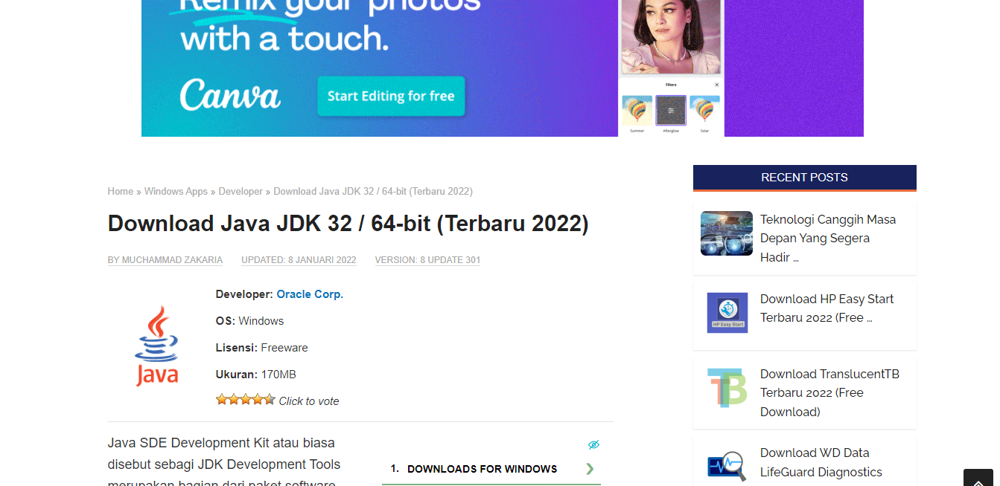

# Apache OFBiz

Apache OFBiz adalah produk open source yang dirancang khusus untuk otomatisasi proses perusahaan yang mencakup komponen kerangka kerja dan aplikasi bisnis untuk ERP (Enterprise Resource Planning), CRM (Customer Relationship Management), E-Business / E-Commerce, SCM (Supply Chain Management), MRP (Manufacturing Resource Planning), MMS/EAM (Maintenance Management System/Enterprise Asset Management). Proyek Apache OFBiz adalah bagian dari The Apache Software Foundation dan dilisensikan di bawah Apache License Version 2.0. Awalnya OFBiz berdiri untuk terbuka untuk bisnis " Open For Business." Apache OFBiz menyediakan fondasi sistem dan titik awal untuk solusi perusahaan yang andal, aman, dan skalabel. Perusahaan dapat menggunakannya, menyesuaikannya atau menggunakannya sebagai kerangka untuk mengimplementasikan kebutuhan bisnis mereka. Dengan OFBiz, sebuah organisasi dapat segera dimulai tanpa biaya penyebaran dan pemeliharaan besar untuk sistem otomatisasi perusahaan tradisional. Seiring pertumbuhan bisnis, mereka dapat memperluas fungsi untuk memenuhi kebutuhan mereka yang lebih canggih. Apache OFBiz menawarkan banyak fungsi bisnis, termasuk: e-commerce, manajemen katalog yang efisien, promosi & manajemen harga, manajemen pesanan aman untuk penjualan & pembelian, manajemen pelanggan (bagian dari manajemen pihak umum), manajemen gudang total, mencakup bagian seperti pemindahan stok secara otomatis, pemilihan batch, dan pengemasan & pengiriman, akuntansi untuk berbagai tujuan seperti faktur, akun pembayaran & penagihan, dan aset tetap, manajemen manufaktur lengkap, manajemen usaha yang umum mencakup bidang utama seperti acara, tugas, proyek, dan permintaan serta pengelolaan konten aman yang mencakup area seperti konten produk, situs web, konten umum, blog, dan forum.

Referensi: https://ofbiz.apache.org/
https://www.predictiveanalyticstoday.com/free-open-source-enterprise-resource-planning-erp-software/
https://blog.capterra.com/free-open-source-erp-software/.
http://e-journal.stmikkomputama.ac.id/index.php/jtb/article/view/4

1. Clone file OFBiz terlebih dahulu 

[Link Github OFBiz](https://github.com/apache/ofbiz-framework)

2. Download dan Install Java JDK
[Link Download](https://www.nesabamedia.com/download-java-se-development-kit-jdk/)

3. Setting path “sesuai direktori yg diinstal java”
    1.	Buka start->ketik edit the system environment variales, lalu klik
    
    
    
    2.	Klik advance-> klik environment variables

    
 
    3.	Lalu klik edit di bagian Systems Variables klik path-> edit 

    
 
    4.	Klik new 

    
 
    5.	Isikan sesuai dengan diektori java yg ada file bin nya lalu salin alamat bin tersebut, jika sudah OK
 
    

4. Jalankan perintah ‘gradlew cleanAll loadAll’
    
    

5. Jalankan ofbiz dengan perintah “gradlew ofbiz”
    
    

5. Masuk ke apache ofbiz https://localhost:8443/accounting
    - Username : admin
    - Password : ofbiz
 
    

6. Halaman dashboard ofbiz
 
 
