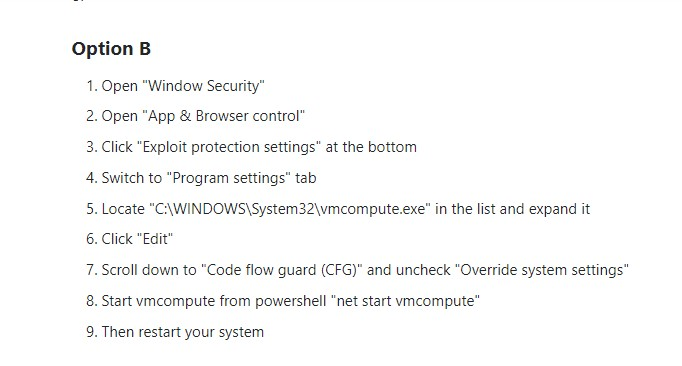
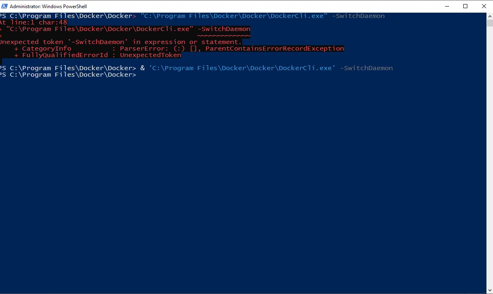
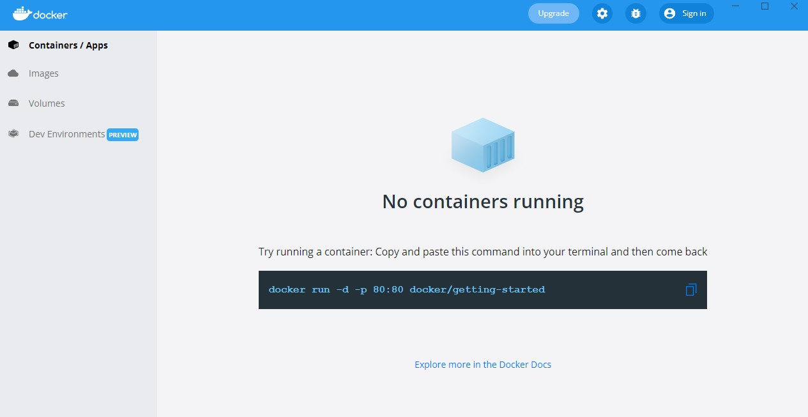
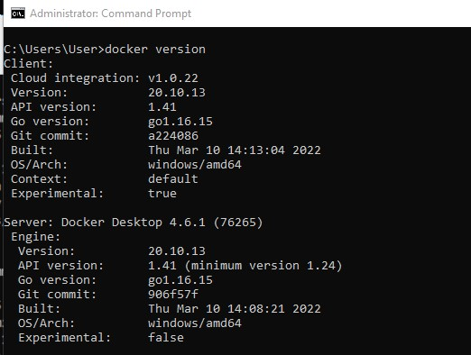
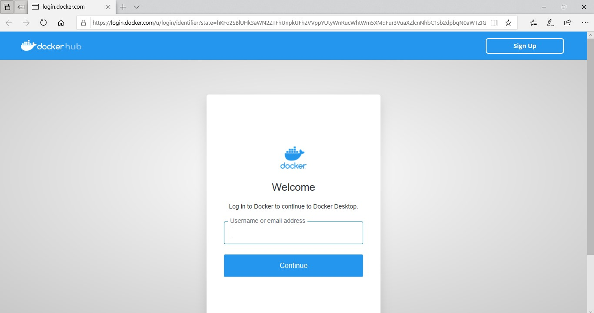
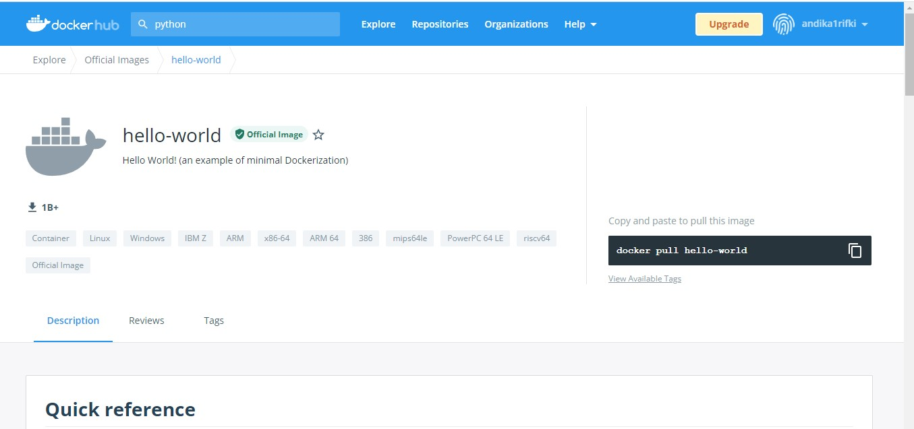
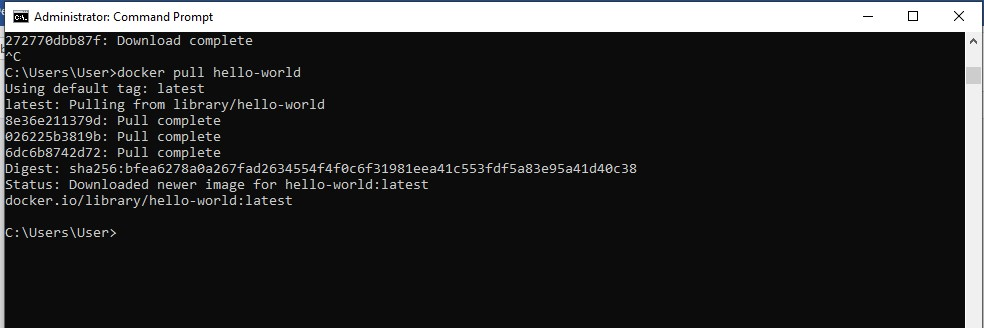
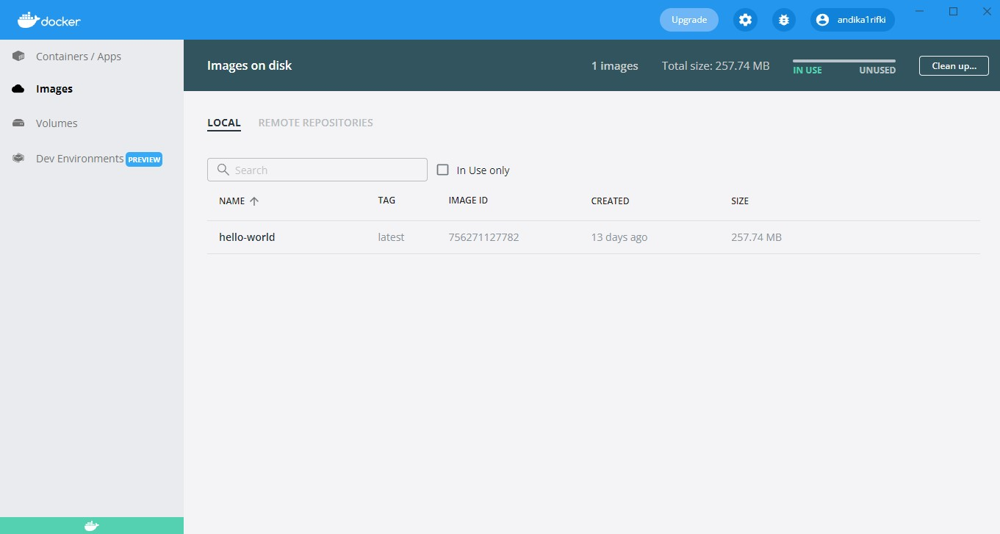
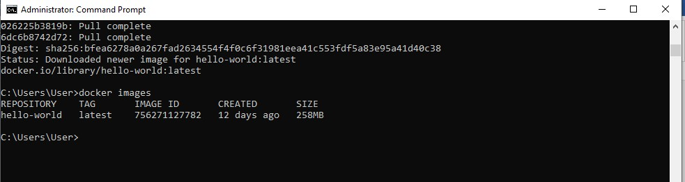
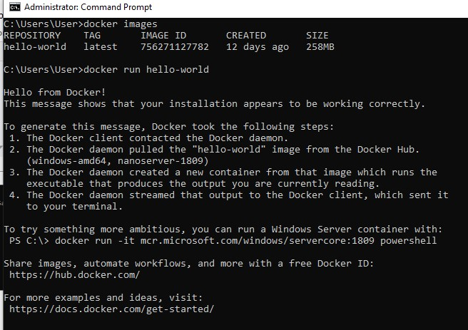

# 215611102 - Andika Rifqi IStanto

# Materi
Apa itu Virtual Machine
Virtual machine (VM) adalah sebuah emulasi dari sebuah sistem komputer. Secara sederhana, virtual machine membuat kita bisa membagi resource hardware dari satu hardware fisik menjadi beberapa sistem komputer.

Sebagai contoh, kita memiliki satu PC yang memiliki prosesor dengan 4 core, RAM sebesar 8 GB serta harddisk 500GB misalnya. Tanpa VM tentu kita hanya bisa menginstall 1 OS atau beberapa OS tapi tak bisa berjalan bersamaan. Dengan VM, kita bisa membagi sistem komputer menjadi dua masing-masing memiliki prosesor 2 core,  RAM 4GB, serta harddisk 250GB dan tentu saja pembagian resource hardware tidak harus sama rata. Dengan ini, maka kita dapat menginstall OS di setiap sistem komputer dan dapat menjalankannya secara bersamaan sehingga kita seolah memiliki 2 PC yang berbeda.

Teknologi ini sering digunakan untuk server dan memunculkan istilah Virtual Private Server (VPS) tapi sedikit pula digunakan oleh app developer karena project yang sedang dikerjakannya memiliki platform yang berbeda dengan platform yang dimiliki.

 

Keunggulan VM
Resource hardware yang eksklusif sehingga tidak terganggu jika ada apps yang lain tiba-tiba membutuhkan resource yang tinggi
Memiliki management tools dan security tools yang sudah matang
Secara umum memiliki tingkat keamanan sedikit lebih tinggi bila dibandingkan dengan container
 

 

Apa Itu Container
Berbeda dari VM, container adalah sebuah virtualisasi OS yang dapat membungkus suatu aplikasi beserta dependency dan environment-nya. Setiap container ini memiliki process yang terisolir sehingga tidak mengganggu host OS ataupun container yang lain. Prinsip container ini mirip dengan kontainer yang ada di kapal kargo di mana kapal kargo tersebut diibaratkan sebagai sistem komputer.

Jika dibandingkan dengan VM, secara pengaturan kontainer lebih mudah. Hal ini disebabkan karena konsep berbagi resource hardware dari container lebih fleksibel bila dibandingkan VM. Sebagai contoh, tadi disebutkan bahwa kita mempunyai 1 PC dengan 4 Core, RAM 8 GB, dan storage sebesar 500GB. Katakanlah kita mempunyai 2 container dengan kebutuhan RAM berbeda. Beberapa apps dalam container A membutuhkan RAM 5GB sedangkan apps dalam container B membutuhkan RAM 2GB. Dengan container, kita tak perlu menset kebutuhan hardware resource setiap container karena berada dalam satu sistem komputer. Sementara jika kita memakai VM dengan hardware resource yang sudah kita bagi sama rata seperti disebutkan di contoh sebelumnya, kita tidak mungkin memasang apps di container A di salah satu sistem komputer karena RAM maksimal yang bisa kita pakai hanyalah 4GB.

Faktor portabilitas juga menjadi kelebihan yang dimiliki oleh container. Para developer bisa membagikan container dengan format ISO image ke setiap perangkat yang dia pakai ataupun ke developer lain.
- [Download Docker](https://docs.docker.com/get-docker/)

#Latihan

1.	Install docker terlebih dahulu

2.	Setting windows security app dulu
 
 

3.	Install switch demo

  

4.	Running aplikasi docker

Cek docker 'docker version'
 

Buat akun terlebih dahulu
 

 

Jika sudah verivikasi emal
5. Mengambil image 
-	Search  ketik “hello-world”
  

Selanjutnya di github ketik perintah `docker pull hello-world`

 
Cek di desktop docker -> images

Perintah cek repository “docker images”

Menjalankan docker run dengan perintah 'docker run hello-world'
 
